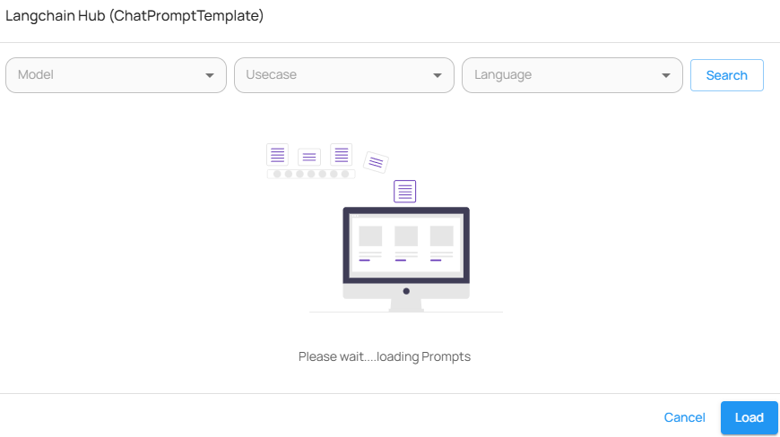

# Chat Prompt Template

LangChain에서 제공하는 ChatPromptTemplate을 기반으로, 시스템 메시지와 사용자 입력 메시지를 동적으로 구성할 수 있는 노드입니다. 프롬프트의 구조를 명시적으로 제어하거나, LangChain Hub에서 사전 정의된 프롬프트를 불러와 사용할 수 있습니다. 주로 LLM 호출 전 프롬프트 포맷을 세분화하거나 구조화할 때 유용합니다.

***

### 주요 기능

* 시스템 메시지와 사용자 메시지를 구조화하여 명확한 역할 지시가 가능한 프롬프트 구성
* Langchain Hub에서 사전 정의된 프롬프트 템플릿을 불러와 바로 활용 가능
* 변수 포맷 지정 및 메시지 이력 설정을 통해 다양한 상황에 맞는 프롬프트 구현
* LLM 호출 전에 프롬프트 구성 로직을 별도 노드로 분리 가능
* 템플릿 재사용 및 프롬프트 파이프라인 통합에 용이

<figure><figcaption>
WindyFlo Chat Prompt Template
</figcaption></figure>

<figure><figcaption>
WindyFlo Chat Prompt Template Langchain Hub
</figcaption></figure>

<figure><figcaption>
WindyFlo Chat Prompt Template Parameters
</figcaption></figure>

### 입력값 (Inputs)

| 항목                    | 설명                                            | 필수 여부 |
| --------------------- | --------------------------------------------- | ----- |
| System Message        | 시스템 역할을 정의하는 텍스트 입력 (예: 번역 도우미 역할 지시 등)       | 필수    |
| Human Message         | 사용자의 입력을 템플릿화할 메시지 (예: `{text}` 형태로 변수 설정 가능) | 필수    |
| Langchain Hub         | 사전 정의된 프롬프트 템플릿을 모델, 언어, 용도 기준으로 선택 가능        | 선택    |
| Format Prompt Values  | 템플릿에서 사용하는 변수에 대한 값 정의(JSON 형태)               | 선택    |
| Additional Parameters | 고급 프롬프트 설정 시 추가 변수 정의 (Advanced Prompt 구성용)   | 선택    |

***

### 파라미터 (Parameters)

| 항목               | 설명                                                                        |
| ---------------- | ------------------------------------------------------------------------- |
| Messages History | 이전 대화 이력을 JSON 형식으로 코드 입력 가능. 시스템/사용자 역할을 포함한 메시지 배열 구조로 구성됨. 예시 확인 기능 제공 |

***

### 출력값 (Outputs)

| 출력 항목              | 설명                                      |
| ------------------ | --------------------------------------- |
| ChatPromptTemplate | 구성된 프롬프트 객체. 이후 LLM 노드에 입력으로 연결하여 사용 가능 |

***

### 활용 예시

* 사용자 질문에 앞서 **시스템 역할을 명확히 설정**해야 하는 챗봇 구성 시
* LangChain Hub에서 제공하는 **표준 프롬프트 템플릿**을 활용하여 일관된 프롬프트 전략 구성 시
* 반복되는 시스템 메시지 구조를 **포맷화하고 변수화**하여 재사용 가능한 프롬프트 제작 시
* **다국어 번역, 분류, 요약 등** 사용 목적에 따라 메시지 포맷을 동적으로 바꿔야 하는 상황에 활용

***

### 사용 팁

* Format Prompt Values 항목에 `{ "text": "Hello" }`와 같이 key-value를 명확히 지정해야 Human Message의 변수와 매칭됩니다.
* Langchain Hub에서 모델/언어/Usecase로 템플릿 검색 시, 로딩 시간이 있으므로 충분히 기다린 후 ‘Load’ 버튼을 클릭하세요.
* Messages History를 활용하면 이전 맥락 기반 응답을 유도할 수 있으나, LLM 사용량 증가에 유의해야 합니다.

***

### 주의사항

* Messages History는 JSON 형식으로 작성해야 하며, 형식 오류 시 실행 실패 가능성 있음
* Format Prompt Values와 템플릿 변수명이 정확히 일치해야 하며, 불일치 시 프롬프트 생성 실패
* 지나치게 많은 메시지 히스토리 입력 시 LLM 토큰 초과 오류 발생 가능
* 프롬프트 내 변수 이름 중복 시 출력이 왜곡될 수 있음
